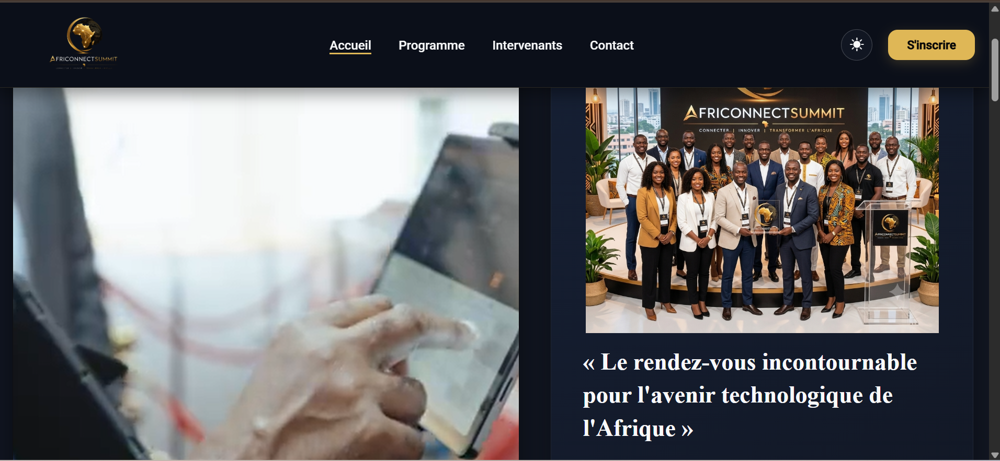
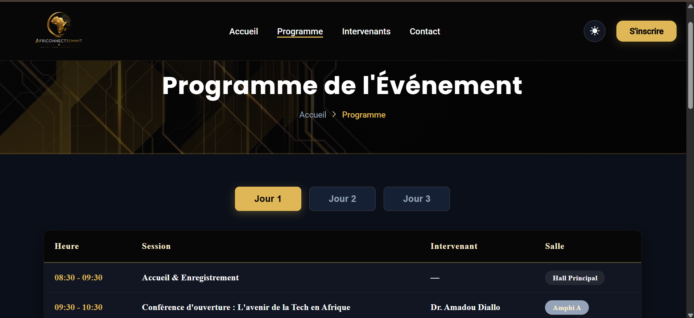
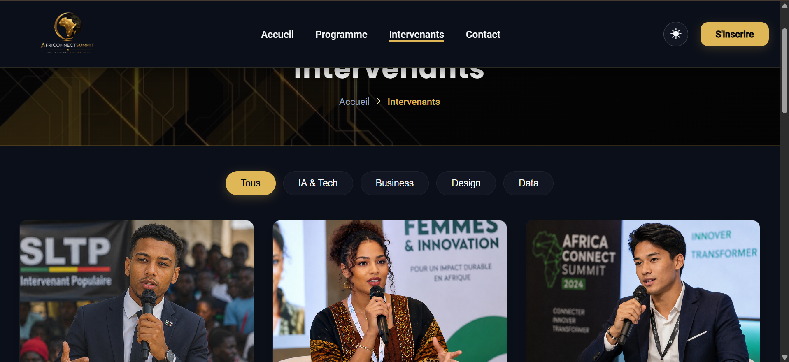
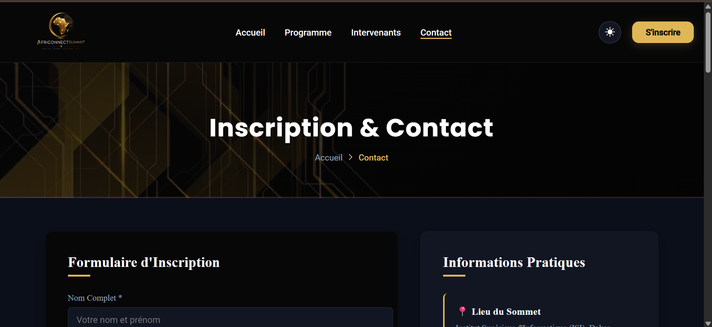

# 🌍 AfriConnect Summit 2026

Projet fil rouge — Plateforme événementielle tech.

**Auteur :** Awa DIAWARA
**Promotion :** Licence 1 Data Science & Big Data — ISI

---

# 🌐 Présentation du Projet

AfriConnect Summit est un site web responsive conçu pour présenter une conférence technologique panafricaine fictive réunissant des développeurs, entrepreneurs, investisseurs et passionnés du numérique.

L'objectif est de proposer une plateforme moderne, intuitive et accessible permettant aux visiteurs de découvrir l'événement, son programme, ses intervenants et de s'inscrire facilement.

---

# 🚀 Fonctionnalités

## 🏠 Page d'accueil (index.html)

- Présentation de la conférence
- Compte à rebours jusqu'à l'événement
- Chiffres clés animés
- Présentation des intervenants vedettes
- Sponsors de la conférence
- Navigation fluide et responsive

## 📅 Programme (programme.html)

- Planning des trois journées
- Onglets interactifs (Jour 1, Jour 2 et Jour 3)
- Présentation des thématiques de la conférence

## 🎤 Intervenants (intervenants.html)

- Présentation des différents intervenants
- Filtrage dynamique par catégorie
- Cartes interactives avec effets au survol

## 📞 Contact (contact.html)

- Formulaire d'inscription
- Validation JavaScript des champs
- FAQ en accordéon CSS
- Carte Google Maps intégrée

---

# 🎯 Objectifs du Projet

Ce projet a été réalisé dans le cadre de l'examen de Technologie Web.

Il permet de mettre en pratique :

- le développement d'un site web moderne ;
- le Responsive Web Design ;
- les animations CSS ;
- la manipulation du DOM avec JavaScript ;
- la gestion d'événements utilisateur ;
- la validation de formulaires ;
- la gestion de versions avec Git et GitHub.

---

# 🛠️ Technologies Utilisées

- **HTML5** : Structure des pages
- **CSS3** : Mise en forme et animations
- **JavaScript (Vanilla)** : Interactivité du site
- **Google Fonts** : Typographie
- **Bootstrap Icons** : Icônes
- **Git & GitHub** : Gestion de version et hébergement

---

# ✨ Fonctionnalités JavaScript

- 🌙 Dark Mode / Light Mode
- 📱 Menu hamburger responsive
- 🎯 Navbar dynamique au scroll
- ⏳ Compte à rebours de l'événement
- 📈 Compteurs animés
- 🎬 Animations avec IntersectionObserver
- 📅 Onglets interactifs du programme
- 👥 Filtrage des intervenants
- 📩 Validation du formulaire
- ⬆️ Bouton Retour en haut
- 📅 Année dynamique dans le footer

---

# 🔗 Liens du Projet

## 🌍 Version en ligne

https://wawamoon16062006.github.io/Diawara-Awa-AfriConnectSummit/

## 📂 Dépôt GitHub

https://github.com/Wawamoon16062006/Diawara-Awa-AfriConnectSummit

---

# 📁 Structure du Projet

```text
Nom-Prenom-AfriConnectSummit/
│
│   index.html
│   programme.html
│   intervenants.html
│   contact.html
│   README.md
│
├───css
│       style.css
│
├───images
│       ...
│
└───js
        main.js
```

---

# 📸 Capture d'Écran

Ajoutez ici les captures des différentes pages :

```markdown







```

---

# 👩‍💻 Réalisé par

**Awa Diawara**  
Étudiante en **L1 Data Science & Big Data — ISI**